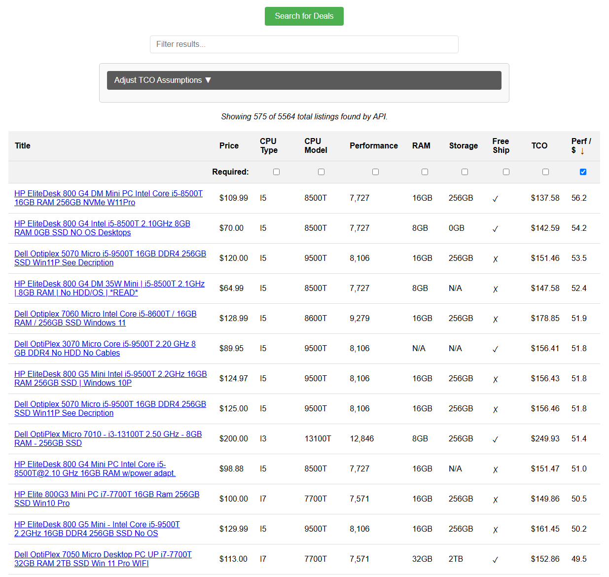

# Homelab Deal Finder – v1.1

Search eBay for small-form-factor PCs, evaluate *total cost of ownership* (TCO),
and surface the best performance-per-dollar deals.  Results are shown in a rich
web UI **and** pushed daily by e-mail when listings exceed your configured
Perf / $ threshold.

---

## 1 .  Features

• On-demand search of live eBay listings (keywords, category, max price)  
• Listing enrichment (CPU model, RAM, storage) via regex parser  
• Performance & idle-power lookup from local data files (`passmark.txt`, `idlepower.txt`)  
• TCO calculator (energy, shipping, RAM/SSD upgrades, AC adapter)  
• Sortable / filterable web UI built with vanilla JS  
• Daily alert worker – 8 AM US/Eastern – sends nicely formatted Mailgun e-mail
  for listings above `perf_per_dollar_min`  
• Containerised with Docker / docker-compose; separate `web` and
  `alert-worker` services.



---

## 2 .  Repository layout

```
shopper/
├── src/                 # application package
│   ├── app.py           # Flask app-factory
│   ├── routes/          # blueprints
│   │   └── search.py
│   ├── ebay_api.py      # eBay REST client
│   ├── enrich_item.py   # domain logic for each listing
│   ├── title_parser.py  # regex extraction
│   ├── data_loader.py   # loads passmark / idlepower once per process
│   ├── tco.py           # backend replica of JavaScript TCO logic
│   ├── alert_service.py # function to run search & send e-mail
│   └── alert_worker.py  # APScheduler blocking process (runs daily)
│
├── templates/           # Jinja2 templates
├── static/              # JS/CSS
│   ├── main.js          # UI logic
│   ├── tco.js           # client-side TCO calc
│   └── utils.js
├── docker-compose.yml   # dev / default stack (web + alert-worker)
├── docker-compose.prod.yml # production overrides (ports, env, replicas …)
├── Dockerfile           # python:3.11-slim image
└── config.yaml.example  # sample configuration (copy to `config.yaml`)
```

---

## 3 .  Quick start

### 3.1  Development

```bash
# clone & enter repo
$ git clone https://github.com/you/shopper.git && cd shopper

# create local config & env files
$ cp config.yaml.example config.yaml
$ cp .env.example   .env            # fill in your secrets

# run the stack with code hot-reloaded via bind-mounts
$ docker compose up --build
```
* open http://localhost:5000 – click **Search** to fetch deals.  
* the `alert-worker` container shares the same bind mount so it uses
  **your** `config.yaml` and will send daily e-mails at 08:00 EST.

### 3.2  Production (Traefik, detached)

```bash
$ docker compose -f docker-compose.yml -f docker-compose.prod.yml up --build -d
```
`docker-compose.prod.yml` usually adds labels for Traefik, turns off bind
mounts, increases worker count, etc.

---

## 4 .  Configuration

`config.yaml` is the single source of truth.  Important keys:

```yaml
ebay:
  app_id: ${EBAY_CLIENT_ID}
  cert_id: ${EBAY_CLIENT_SECRET}
  sandbox: false            # true = use eBay sandbox API

search:
  keywords: "ThinkCentre Tiny, OptiPlex Micro, N100"
  category_id: 171957
  max_price: 250
  full_search: false        # set true to paginate all pages (slower)

app:
  tco_assumptions:
    kwh_cost: 0.14
    lifespan_years: 5
    shipping_cost_t_cpu: 10
    shipping_cost_non_t_cpu: 35
    required_ram_gb: 16
    ram_upgrade_flat_cost: 30
    required_storage_gb: 128
    storage_upgrade_flat_cost: 15

alerts:
  perf_per_dollar_min: 40
  recipients:
    - you@example.com
```

### Environment variables (`.env`)
```
EBAY_CLIENT_ID=...
EBAY_CLIENT_SECRET=...
SECRET_KEY=super-secret-flask-key
MAILGUN_API_KEY=key-xxxxxxxxxxxxxxxx
MAILGUN_DOMAIN=mg.example.com
FLASK_ENV=production          # or development
```
`.env` is loaded automatically by docker-compose; **never commit it**.

---

## 5 .  Running tests

```bash
$ docker compose run --rm web pytest
```
Covers config validation, eBay API mocks, and the title-parser.

---

## 6 .  Common commands

Manual alert run (sanity-check email formatting):
```bash
docker compose run --rm alert-worker python -m src.alert_service
```

Rebuild & restart only the worker after changing alert logic:
```bash
docker compose up --build -d alert-worker
```

---

## 7 .  License

AGPL-3.0 – see LICENSE.

